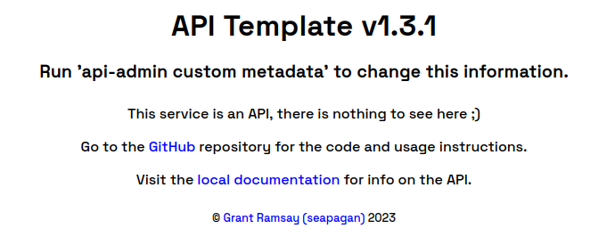

# FastAPI Application Template <!-- omit in toc -->

This is a template Repository for starting a new
[FastAPI](https://fastapi.tiangolo.com/) project with Authentication and Users,
with Authorization already baked-in.

- [Functionality](#functionality)
- [How to use](#how-to-use)
- [Configuration](#configuration)
- [Development](#development)
  - [Set up a Virtual Environment](#set-up-a-virtual-environment)
  - [Install required Dependencies](#install-required-dependencies)
  - [Migrate the Database](#migrate-the-database)
  - [Customize the Metadata](#customize-the-metadata)
    - [Manually](#manually)
    - [Using the provided configuration tool](#using-the-provided-configuration-tool)
    - [Funding Link](#funding-link)
  - [Customize the HTML templates](#customize-the-html-templates)
  - [Add a user](#add-a-user)
  - [Run a development Server](#run-a-development-server)
- [Deploying to Production](#deploying-to-production)
- [Who is Using this Template?](#who-is-using-this-template)
- [Planned Functionality](#planned-functionality)
- [Contributing](#contributing)
- [Project Organization](#project-organization)
- [Provided Routes](#provided-routes)
  - [**`GET`** _/users/_](#get-users)
  - [**`GET`** _/users/me_](#get-usersme)
  - [**`POST`** _/users/{user\_id}/make-admin_](#post-usersuser_idmake-admin)
  - [**`POST`** _/users/{user\_id}/password_](#post-usersuser_idpassword)
  - [**`POST`** _/users/{user\_id}/ban_](#post-usersuser_idban)
  - [**`POST`** _/users/{user\_id}/unban_](#post-usersuser_idunban)
  - [**`PUT`** _/users/{user\_id}_](#put-usersuser_id)
  - [**`DELETE`** _/users/{user\_id}_](#delete-usersuser_id)
  - [**`POST`** _/register/_](#post-register)
  - [**`POST`** _/login/_](#post-login)
  - [**`POST`** _/refresh/_](#post-refresh)

## Functionality

This template is a ready-to-use boilerplate for a FastAPI project. It has the
following advantages to starting your own from scratch :

- Baked-in User database and management. Routes are provided to add/edit/delete
  or ban (and unban) Users.
- Postgresql Integration, using SQLAlchemy ORM, no need for raw SQL queries
  (unless you want to!). All database usage is Asynchronous.
  [Alembic](https://github.com/sqlalchemy/alembic) is used to control database
  migrations.
- Register and Login routes provided, both of which return a JWT token to be
  used in all future requests. JWT Token expires 120 minutes after issue.
- JWT-based security as a Bearer Token to control access to all your routes.
- A `Refresh Token` with 30 day expiry is sent at time of register or login
  (never again). This will enable easy re-authentication when the JWT expires
  without needing to send username or password again, and should be done
  automatically by the Front-End.
- A clean layout to help structure your project.
- **A command-line admin tool**. This allows to configure the project metadata
  very easily, add users (and make admin), and run a development server. This
  can easily be modified to add your own functionality (for example bulk add
  data) since it is based on the excellent
  [asyncclick](https://github.com/python-trio/asyncclick) library.
- Database and Secrets are automatically read from Environment variables or a
  `.env` file if that is provided.
- User email is validated for correct format on creation (however no checks are
  performed to ensure the email or domain actually exists).
- Control permitted CORS Origin through Environment variables.
- Manager class set up to send emails to users, and by default an email is sent
  when new users register. The content is set by a template (currently a
  basic placeholder). This email has a link for the user to confirm their email
  address - until this is done, the user cannot user the API.

The template **Requires Python 3.7+**

This template is free to use but I would request some accreditation. If you do
use it in one of your applications, please put a small note in your readme
stating that you based your project on this Template, with a link back to this
repository. Thank You 😊

For those who let me know they are using this Template, I'll add links back to
your project in this documentation.

If this template saves you time/effort/money, or you just wish to show your
appreciation for my work, why not [Buy me a
Coffee!](https://www.buymeacoffee.com/seapagan) 😃

## How to use

Click the 'Use this template' button at the top of the Repository on GitHub.
This will create a new repository in your personal GitHub account (Not a Fork)
which you can then Clone and start working on.

It is assumed that you have at least some knowledge of
[FastAPI](https://fastapi.tiangolo.com/) to use this template, there are very
good [Basic](https://fastapi.tiangolo.com/tutorial/) and
[Advanced](https://fastapi.tiangolo.com/advanced/) User Guides on the FastAPI
website .

## Configuration

Database (and other) settings can be read from environment variables or from a
`.env` file in the project root. By default, these are only used for the
Database setup and JWT Secret Key. See the [.env.example](.env.example) file for
how to use.

```ini
# The Base API Url. This is where your API wil be served from, and can be read
# in the application code. It has no effect on the running of the applciation
# but is an easy way to build a path for API responses. Defaults to
# http://localhost:8000
BASE_URL=http://localhost:8000

# Database Settings These must be changed to match your setup.
DB_USER=dbuser
DB_PASSWORD=my_secret_passw0rd
DB_ADDRESS=localhost
DB_PORT=5432
DB_NAME=my_database_name

# generate your own super secret key here, used by the JWT functions.
# 32 characters or longer, definately change the below!!
SECRET_KEY=123456

# List of origins that can access this API, separated by a comma, eg:
# CORS_ORIGINS=http://localhost,https://www.gnramsay.com
# If you want all origins to access (the default), use * or leave commented:
CORS_ORIGINS=*
```

For a **PUBLIC API** (unless its going through an API gateway!), set
`CORS_ORIGINS=*`, otherwise list the domains (**and ports**) required. If you
use an API gateway of some nature, that will probably need to be listed.

To generate a good secret key you can use the below command on Linux or Mac:

```console
$ openssl rand -base64 32
xtFhsNhbGOJG//TAtDNtoTxV/hVDvssC79ApNm0gs7w=

```

If the database is not configured or cannot be reached, the Application will
disable all routes, print an error to the console, and return a a 500 status
code with a clear JSON message for all routes. This saves the ugly default
"Internal Server Error" from being displayed.

## Development

### Set up a Virtual Environment

It is always a good idea to set up dedicated Virtual Environment when you are
developing a Python application. If you use Poetry, this will be done
automatically for you when you run `poetry install`.

Otherwise, [Pyenv](https://github.com/pyenv/pyenv) has a
[virtualenv](https://github.com/pyenv/pyenv-virtualenv) plugin which is very
easy to use.

Also, check out this
[freeCodeCamp](https://www.freecodecamp.org/news/how-to-setup-virtual-environments-in-python/)
tutorial or a similar
[RealPython](https://realpython.com/python-virtual-environments-a-primer/) one
for some great info. If you are going this (oldschool!) way, I'd recommend using
[Virtualenv](https://virtualenv.pypa.io/en/latest/) instead of the built in
`venv` tool (which is a subset of this).

### Install required Dependencies

The project has been set up using [Poetry](https://python-poetry.org/) to
organize and install dependencies. If you have Poetry installed, simply run the
following to install all that is needed.

```console
poetry install
```

If you do not (or cannot) have Poetry installed, I have provided an
auto-generated `requirements.txt` in the project root which you can use as
normal:

```console
pip install -r requirements.txt
```

I definately recommend using Poetry if you can though, it makes dealing with
updates and conflicts very easy.

If using poetry you now need to activate the VirtualEnv:

```console
poetry shell
```

### Migrate the Database

Make sure you have [configured](#configuration) the database. Then run the
following command to setup the database:

```console
alembic upgrade head
```

Everytime you add or edit a model, create a new migration then run the upgrade
as shown below:

```console
alembic revision -m "<My commit message>"
alembic upgrade head
```

Check out the [Alembic](https://github.com/sqlalchemy/alembic) repository for
more information on how to use (for example how to revert migrations).

### Customize the Metadata

By default the Template Title, Description, Author and similar is set to my
details. Changing this is very easy though, and there are 2 ways you can do.

#### Manually

Metadata is stored in the [config/metadata.py](config/metadata.py) file and this
can be edited by hand if desired:

```python
from config.helpers import MetadataBase

custom_metadata = MetadataBase(
    title="API Template",
    description="Run 'api-admin custom metadata' to change this information.",
    repository="https://github.com/seapagan/fastapi-template",
    license_info={
        "name": "MIT",
        "url": "https://opensource.org/licenses/MIT",
    },
    contact={
        "name": "Grant Ramsay",
        "url": "https://www.gnramsay.com",
    },
    email="seapagan@gmail.com",
)
```

You can change the values in this dictionary as needed. You should also change
the name, description and authors in the [pyproject.toml](pyproject.toml) file.

For the License URL, you can find a list in the
[helpers.py](config/helpers.py#L18)

#### Using the provided configuration tool

The `api-admin` command can also do this for you, asking for the values at the
command line and automatically updating both files:

```console
$ api-admin custom metadata

API-Template : Customize application Metadata

Enter your API title [API Template]:
Enter the description [Run 'api-admin custom metadata' to change this information.]:
URL to your Repository [https://github.com/seapagan/fastapi-template]:

Choose a license from the following options.
Apache2, BSD3, BSD2, GPL, LGPL, MIT, MPL2, CDDL, EPL
Your Choice of License? [MIT]:

Author name or handle [Grant Ramsay]:
Contact Email address [seapagan@gmail.com]:
Author Website [https://www.gnramsay.com]:

You have entered the following data:
Title       : API Template
Description : Run 'api-admin custom metadata' to change this information.
Repository  : https://github.com/seapagan/fastapi-template
License     : MIT
Author      : Grant Ramsay
Email       : seapagan@gmail.com
Website     : https://www.gnramsay.com

Is this Correct? [Y/n]: y

-> Writing out Metadata .... Done!
```

This will also put in the correct License URL link automatically.

#### Funding Link

The template does include a [.github/FUNDING.yml](.github/FUNDING.yml) file
which contains a link to my [Buy Me A
Coffee](https://www.buymeacoffee.com/seapagan) page. You can edit or delete this
as you will or replace with your own details. If you really appreciate the
Template, feel free to leave my details there in addition to your own, though
this is entirely optional 😊

The funding file allows your GitHub visitors to sponsor or tip you as a thanks
for your work.

### Customize the HTML templates

There are several HTML templates used at this time, all are stored in the
[templates](templates/) folder or a subfolder of this.

- [index.html](templates/index.html) - This template is shown when the root of the API is visited using
a web browser instead of an API call. Use it to display vasic details about your
API and usage instructions, point to the documentation etc. The default output
is below for an example:



- [email/](/templates/email) - this folder contains HTML Email templates, **currently only
basic placeholders**.
  - `welcome.html`. This is sent to a new User when they sign up

### Add a user

It is possible to add Users to the database using the API itself, but you cannot
create an Admin user this way, unless you aready have an existing Admin user in
the database.

This template includes a command-line utility to create a new user and
optionally make them Admin at the same time:

```console
./api-admin user create
```

You will be asked for the new user's email etc, and if this should be an
Admin user (default is to be a standard non-admin User). These values can be
added from the command line too, for automated use. See the built in help for
details :

```console
$ ./api-admin user create --help
Usage: api-admin user create [OPTIONS]

  Create a new user.

  Values are either taken from the command line options, or interactively for
  any that are missing.

Options:
  -e, --email TEXT       [required]
  -f, --first_name TEXT  [required]
  -l, --last_name TEXT   [required]
  -p, --password TEXT    [required]
  -a, --admin TEXT       [required]
  --help                 Show this message and exit.
```

### Run a development Server

The [uvicorn](https://www.uvicorn.org/) ASGI server is automatically installed
when you install the project dependencies. This can be used for testing the API
during development. There is a built-in command to run this easily :

```console
api-admin dev
```

This will by default run the server on <http://localhost:8000>, and reload after
any change to the source code. You can add options to change this

```console
$ api-admin dev --help

Usage: api-admin dev [OPTIONS]

  Run a development server from the command line.

  This will auto-refresh on any changes to the source in real-time.

Options:
  -h, --host TEXT       Define the interface to run the server on.  [default:
                        localhost]
  -p, --port INTEGER    Define the port to run the server on  [default: 8000]
  -r, --reload BOOLEAN  [default: True]
  --help                Show this message and exit.
```

If you need more control, you can run `uvicorn` directly :

```console
uvicorn main:app --reload
```

The above command starts the server running on <http://localhost:8000>, and it
will automatically reload when it detects any changes as you develop.

**Note: Neither of these are suitable to host a project in production, see the
next section for information.**

## Deploying to Production

There are quite a few ways to deploy a FastAPI app to production. There is a
very good discussion about this on the FastAPI [Deployment
Guide](https://fastapi.tiangolo.com/deployment/) which covers using Uvicorn,
Gunicorn and Containers.

My Personal preference is to serve with Gunicorn, using uvicorn workers behind
an Nginx proxy, though this does require you having your own server. There is a
pretty decent tutorial on this at
[Vultr](https://www.vultr.com/docs/how-to-deploy-fastapi-applications-with-gunicorn-and-nginx-on-ubuntu-20-04/).
For deploying to AWS Lambda with API Gateway, there is a really excellent Medium
post (and it's followup)
[Here](https://medium.com/towards-data-science/fastapi-aws-robust-api-part-1-f67ae47390f9),
or for AWS Elastic Beanstalk there is a very comprehensive tutorial at
[testdriven.io](https://testdriven.io/blog/fastapi-elastic-beanstalk/)

> Remember:  you still need to set up a virtual environment, install all the
> dependencies, setup your `.env` file (or use Environment variables if your
> hosting provider uses these - for example Vercel or Heroku) and set up and
> migrate your Database, exactly the same as for Develpment as desctribed above.

## Who is Using this Template?

Meh, at the moment probably no-one except me 😆. If you do use this in one of your own
projects, drop me a message and I'll add your profile and project links here 😃

## Planned Functionality

See the [TODO.md](TODO.md) file for plans.

## Contributing

Please **do** feel free to open an Issue for any bugs or issues you find, or
even a Pull Request with solutions 😎

Likewise, I am very open to new feature Pull Requests!

1. Fork it
2. Create your feature branch (`git checkout -b my-new-feature`)
3. Commit your changes (`git commit -am 'Add some feature'`)
4. Push to the branch (`git push origin my-new-feature`)
5. Create a new Pull Request

## Project Organization

This project has been deliberately laid out in a specific way. To avoid long
complicated files which are difficult to debug, functionality is separated out
in files and modules depending on the specific functionality.

[main.py](main.py) - The main controlling file, this should be as clean and
short as possible with all functionality moved out to modules.

[database/](/database) - This module controls database setup and configuration,
and should generally not need to be touched.

[config/](/config) - Handles the API settings and defaults, also the Metadata
customization. If you add more settings (for example in the `.env` file) you
should also add them to the [settings.py](config/settings.py) or
[metadata.py](config/metadata.py) with suitable defaults. Non-secret (or
depoloyment independent) settings should go ing the `metadata` file, while
secrets (or deployment specific) should go in the `settings` and `.env` files

[commands/](/commands) - This directory can hold any commands you need to write,
for example populating a database, create a superuser or other housekeeping
tasks.

[managers/](/managers) - This directory contains individual files for each
'group' of functionality. They contain a Class that should take care of the
actual work needed for the routes. Check out the [auth.py](managers/auth.py) and
[user.py](managers/user.py)

[migrations/](/migrations) - We use
[Alembic](https://github.com/sqlalchemy/alembic) to handle the database
migrations. Check out their pages for more info. See instructions under
[Development](#development) for more info.

[models/](/models) - Any database models used should be defined here along with
supporting files (eq the [enums.py](models/enums.py)) used here. Models are
specified using the SQLAlchemy format, see [user.py](models/user.py) for an
example.

[resources/](/resources) - Contains the actual Route resources used by your API.
Basically, each grouped set of routes should have its own file, which then
should be imported into the [routes.py](resources/routes.py) file. That file is
automatically imported into the main application, so there are no more changes
needed. Check out the routes in [user.py](resources/user.py) for a good example.
Note that the routes contain minimal actual logic, instead they call the
required functionality from the Manager ([UserManager](managers/user.py) in this
case).

[schemas/](/schemas) - Contains all `request` and `response` schemas used in the
application, as usual with a separate file for each group. The Schemas are
defined as [Pydantic](https://pydantic-docs.helpmanual.io/) Classes.

[static/](/static) - Any static files used by HTML templates for example CSS or
JS files.

[templates/](/templates) - Any HTML templates. We have one by default - used
only when the root of the API is accessed using a Web Browser (otherwise a
simple informational JSON response is returned). You can edit the template in
[index.html](templates/index.html) for your own API.

## Provided Routes

By default, this template comes with routes for Authentication and User control.
These can be tweaked if required, and form a base for you to add your own
api-specific routes.
For full info and to test the routes, you can go to the `/docs` path on a
running API for interactive Swagger (OpenAPI) Documentation.

<!-- openapi-schema -->

### **`GET`** _/users/_

> Get Users : _Get all users or a specific user by their ID._
>
> To get a specific User data, the requesting user must match the user_id, or
> be an Admin.
>
> user_id is optional, and if omitted then all Users are returned. This is
> only allowed for Admins.

### **`GET`** _/users/me_

> Get My User Data : _Get the current user's data only._

### **`POST`** _/users/{user_id}/make-admin_

> Make Admin : _Make the User with this ID an Admin._

### **`POST`** _/users/{user_id}/password_

> Change Password : _Change the password for the specified user._
>
> Can only be done by an Admin, or the specific user that matches the user_id.

### **`POST`** _/users/{user_id}/ban_

> Ban User : _Ban the specific user Id._
>
> Admins only. The Admin cannot ban their own ID!

### **`POST`** _/users/{user_id}/unban_

> Unban User : _Ban the specific user Id._
>
> Admins only.

### **`PUT`** _/users/{user_id}_

> Edit User : _Update the specified User's data._
>
> Available for the specific requesting User, or an Admin.

### **`DELETE`** _/users/{user_id}_

> Delete User : _Delete the specified User by user_id._
>
> Admin only.

### **`POST`** _/register/_

> Register A New User : _Register a new User and return a JWT token plus a Refresh Token._
>
> The JWT token should be sent as a Bearer token for each access to a
> protected route. It will expire after 120 minutes.
>
> When the JWT expires, the Refresh Token can be sent using the '/refresh'
> endpoint to return a new JWT Token. The Refresh token will last 30 days, and
> cannot be refreshed.

### **`POST`** _/login/_

> Login An Existing User : _Login an existing User and return a JWT token plus a Refresh Token._
>
> The JWT token should be sent as a Bearer token for each access to a
> protected route. It will expire after 120 minutes.
>
> When the JWT expires, the Refresh Token can be sent using the '/refresh'
> endpoint to return a new JWT Token. The Refresh token will last 30 days, and
> cannot be refreshed.

### **`POST`** _/refresh/_

> Refresh An Expired Token : _Return a new JWT, given a valid Refresh token._
>
> The Refresh token will not be updated at this time, it will still expire 30
> days after original issue. At that time the User will need to login again.
<!-- openapi-schema-end -->

The route table above was automatically generated from an `openapi.json` file by
my [openapi-readme](https://pypi.org/project/openapi-readme/) project. Check it
out for your own API documentation! 😊
