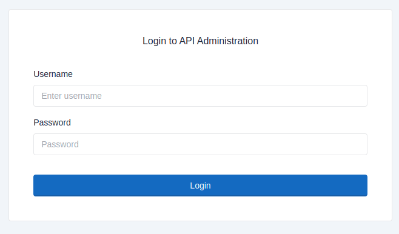
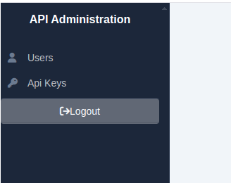
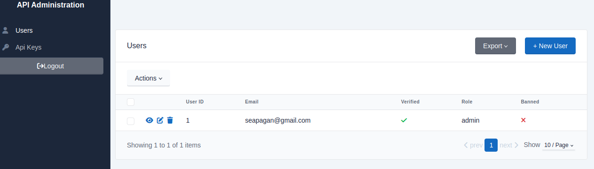

# Administration Site

## Overview

There is an (optional) administration site included in this template. This is
built using the [sqladmin](https://aminalaee.dev/sqladmin/){:target="_blank"}
package and gives you an easy way to manage your users and API keys.

!!! warning
    Only **existing admin users** can access the site, so they need to already
    exist in the database, created using the API or CLI.

    _It is **NOT** possible to create new admin users using the admin site._

## Enable the Admin Site

This admin panel is **DISABLED BY DEFAULT** and needs to be enabled by setting
the `ADMIN_PAGES_ENABLED` environment variable to `true` in your `.env` file or in
your environment.

```ini
ADMIN_PAGES_ENABLED=true
```

## Using the Admin Site

Once enabled, you can access the admin site at `/admin` on your server. You can
then log in using the username and password of an admin user:



You can view/edit the users and API keys in the database, choose from the
sidebar:



This will then list the table and allow you to view, edit or delete the users or
api keys.



## Customising the Admin Site

There are a couple of ENV variables that you can set to customise the admin
site:

```ini
# Admin Pages Settings
ADMIN_PAGES_ROUTE=/admin
ADMIN_PAGES_TITLE="API Administration"
ADMIN_PAGES_ENCRYPTION_KEY=change_me_to_a_secret_fernet_key (optional)
ADMIN_PAGES_TIMEOUT=86400
```

The above are the defaults for the variables that wil be used if you do not set
them in your environment or `.env` file.

- `ADMIN_PAGES_ROUTE` - The route to access the admin site
- `ADMIN_PAGES_TITLE` - The title of the admin site
- `ADMIN_PAGES_ENCRYPTION_KEY` - The (OPTIONAL)key used to encrypt the session
  data (see below)
- `ADMIN_PAGES_TIMEOUT` - The timeout for the session data (in seconds,
  defaults to 86400 seconds which is 24 hours)

## Session Encryption

By default, the admin site uses the `Fernet` encryption method to encrypt the
session data. You can set the `ADMIN_PAGES_ENCRYPTION_KEY` to a secret key to
use for this encryption. If you do not set this, a random secure key will be
generated for you each time the server is restarted (which will invalidate any
current sessions so users just will need to log back in again).

### Automatically Generating a Key

To ensure that active sessions will persist after a server restart, you can
generate a key using the CLI:

```console
api-admin keys -a
```

This will generate a secure key, and optionally update the `.env` file. If you
choose not to update the file, you can copy the key from the console output and
paste it into the `.env` file:

```ini
ADMIN_PAGES_ENCRYPTION_KEY=your_generated_key_here
```

### Manually Generating a Key

You can also manually generate a key using the `Fernet` library in Python:

```python
from cryptography.fernet import Fernet
key = Fernet.generate_key().decode()
print(key)```
```

You can then set this key in your environment or `.env` file:

```ini
ADMIN_PAGES_ENCRYPTION_KEY=your_generated_key_here
```
